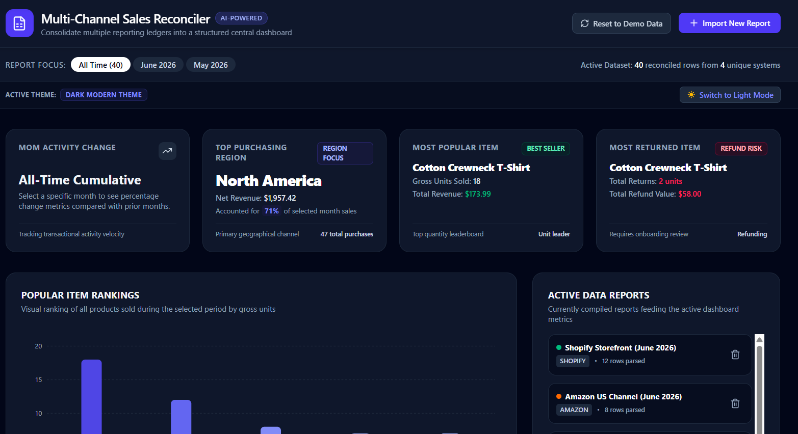

# Smart Multi-Channel Sales Reconciler 📊✨

Welcome to the **Smart Multi-Channel Sales Reconciler**, a modern, full-stack financial dashboard designed to ingest, parse, and consolidate unstructured multi-channel sales reports. Powered by a server-side **Gemini 3.5 Flash** engine, this application automates the tedious work of financial data preparation, transforming messy, raw text logs into structured ledger databases and interactive visual analytics.

You can find the published app [here](https://sc-multi-channel-sales-reconciler.ai.studio/)

---

## 🚀 Core Features & Capabilities

- **AI-Powered Schema Reconciliation**: Paste any unstructured sales logs, emails, CSV/TSV fragments, or invoices. The integrated `gemini-3.5-flash` model intelligently maps raw fields into standardized transaction schemas in real-time.
- **Unified Multi-Channel Integration**: Consolidate reports from disparate channels like **Shopify**, **Amazon**, **POS (Point of Sale)**, **Stripe**, or any **Custom** platform into a singular source of truth.
- **Dynamic Theming System**: Switch seamlessly between a clean, high-contrast **Light Elegant Theme** and a modern **Dark Modern Theme** (with persistent `localStorage` saving).
- **Temporal Analysis**: Dynamically filter active datasets by fiscal month or drill down into all-time cumulative metrics.
- **Export Ready**: Compile and export your reconciled datasets directly to formatted CSV sheets with a single click.

---

## 🖥️ Operational Dashboard Sections

The workspace is arranged in a clean, desktop-optimized, single-screen layout with dedicated operational modules:

### 1. Header & Filter Controls
* **Report Focus & Filter Bar**: Located at the top of the workspace. Filter the active dataset dynamically by selecting specific calendar months or clicking **All Time** to review the complete, unified history.
* **Active Theme Switcher**: Positioned right beneath the filters. A dedicated dual-state toggler allows instantaneous transition between light and dark visual mode.

### 2. Key Performance Indicators (KPI) Panel
Four high-fidelity metrics cards provide instant, dynamic updates based on the active report filters:
* **MoM Activity Change**: Tracks net sales revenue velocity, transaction volumes, and refund percentages against preceding months.
* **Top Purchasing Region**: Highlights the highest-grossing geographical region, including net revenue contribution percentage.
* **Most Popular Item**: Identifies the best-selling product by gross unit volume, displaying units sold and gross sales value.
* **Most Returned Item (Refund Risk)**: Flags products showing high refund counts and total money refunded, highlighting customer success or manufacturing review needs.

### 3. Visual Analytics & active Channels
* **Popular Item Rankings (Recharts Bar Chart)**: A horizontal visual ranking of all products sold during the selected period. Styled cleanly, supporting interactive tooltips, and adaptively rendered for both light and dark modes.
* **Active Data Reports panel**: Lists the current data source reports feeding into the active dataset. Displays record counts, source channels, and provides a quick option to delete individual sources and trigger real-time, cascading metric updates.

### 4. Regional Contribution & Refund Leaderboard
* **Regional Net Revenue Split**: Interactive progress bar meters illustrating percentage-based contributions across geographic regions (e.g., North America, Europe, Asia-Pacific, Latin America, Middle East & Africa).
* **Refunded Items Leaderboard**: An itemized list sorting returns by unit count, displaying total refunded currency value to assist with vendor feedback and quality control.

### 5. Central Compiled Report Ledger
* **Searchable & Filterable Table**: A powerful ledger database containing every parsed, consolidated row.
* **Granular Controls**: Free-text search matching product names, regions, or channels. Filter rows by transaction types (Sales vs. Returns) or isolate specific source channels.
* **Export Ledger (CSV)**: Generates a fully compliant comma-separated file representing the active filtered dataset for immediate download and import into Microsoft Excel or Google Sheets.

---

## 📈 Uncovering Data Insights

This application equips onboarding managers, accountants, and retail operators with several ways to uncover critical operational intelligence:

1. **MoM Growth and Velocity Auditing**: Select specific months to analyze whether marketing campaigns and inventory changes resulted in month-over-month revenue growth, or if transaction counts fluctuated.
2. **Channel Performance Mapping**: Use the **Active Data Reports** and ledger filters to isolate Shopify orders from POS (physical store) transactions to compare digital vs. brick-and-mortar success.
3. **Product Demand Clustering**: Review the **Popular Item Rankings** chart to identify high-volume items and plan warehouse procurement schedules.
4. **Geographic Strategy and Focus**: Leverage the **Regional Net Revenue Split** progress bars to see where products are most successful, allowing optimization of geographical advertising budgets.
5. **Return and Quality Risk Mitigations**: Check the **Most Returned Item** card and the **Refunded Items Leaderboard** to quickly spot product quality issues or delivery problems before they hurt overall profitability.

---

## 📥 Ingesting and Uploading Data

To add new report logs to your dashboard, click **Add & Reconcile Another Report** on the Active Data Reports panel to slide open the import drawer.

### Required Fields:
1. **Descriptive Report Name**: Provide a unique identifier (e.g., `"Shopify June Orders"`, `"POS Terminal 3"`, `"Amazon Q2 Returns"`).
2. **Origin Channel**: Select the system type (Shopify, Amazon, POS, Stripe, or Custom).
3. **Raw Report Data / Ledger Paste**: Paste raw unstructured text, CSV lines, TSV spreadsheets, or raw emails.

### Supported Data Formats:
The Gemini AI parsing engine is extremely robust and can reconcile:
* **Unstructured Text & Emails**: Pasted order emails or customer refund receipts.
* **TSV / CSV Spreadsheet Snippets**: Raw copied rows from Microsoft Excel or Google Sheets.
* **Point of Sale Journal Logs**: Text dumps containing date, item name, quantity, and currency indicators.
* **Messy or Disorganized Ledger Rows**: Random line listings with unstructured dates, different country/currency notations, and missing values.

### Quick Test Templates:
Want to test the parser instantly? The import drawer includes three built-in **Quick Test Templates** that you can click to paste sample unstructured logs representing:
- **Shopify Unstructured Receipts**
- **Amazon TSV Export Snippets**
- **POS Journal Logs**

*Note: Make sure your `GEMINI_API_KEY` is configured in **Settings > Secrets** to enable server-side parsing.*
